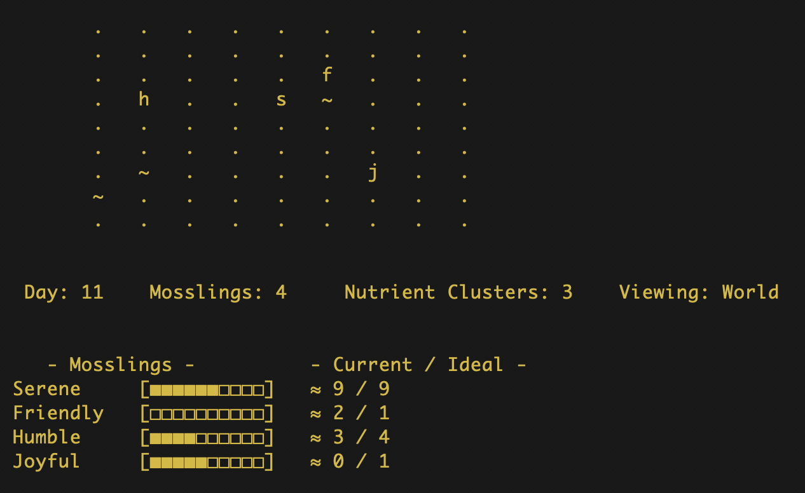

## July 14, 2026

### A Tragic Tale of Two Hungry Mosslings

The Friendly Mossling, desperate for nourishment, begins a long journey toward the nearest nutrient cluster.

Days pass.

Just as Friendly reaches a tile adjacent to the cluster, the Serene Mossling notices the same nutrient cluster nearby. Recognizing her own dwindling energy, she wanders toward it. Before long, she too stands just one tile away.

Serene isn't as desperate as Friendly. She has no way of knowing that the other Mossling has been traveling toward this cluster for days—or that it represents Friendly's last chance to survive.

A new day begins.

Both Mosslings stand one move away from the same nutrient cluster.

It is Serene's turn to move first.

She does the most natural thing in the world. She glides onto the nutrient cluster and engorges herself on its succulent vitality.

Friendly arrives one moment too late.

The nutrient cluster is gone.

Had death already existed in Mossworld, Friendly's quiet journey would have ended there.

 

**Emergent from**

- Hunger driving both Mosslings toward the same objective.
- Goal-directed movement based on local information.
- Sequential turn order determining who reached the nutrient cluster first.
- A finite nutrient cluster that could only sustain one Mossling.

 

**Significance**

This was the first narrative to emerge from Mossworld. I had anticipated this moment. Although the simulation contains no logic for competition or sacrifice, conflict over limited resources inevitably arises from the Mosslings' local rules and interactions. Yet watching the tragedy unfold naturally, without any scripted narrative, made the simulation feel like a living world rather than a collection of mechanics.

 

  

  <em>Figure 1. After days of travel, Friendly finally reaches the nutrient cluster just as Serene discovers it nearby. With both Mosslings one move away, the simulation's sequential turn order determines who reaches it first.</em>

